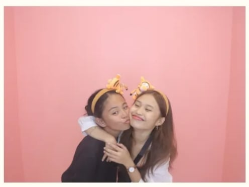

<html lang="en">
<head>
    <meta charset="utf-8" />
    <meta name="viewport" content="width=device-width,initial-scale=1" />
    <title>For My Baby</title>

    <!-- Fonts -->
    <link href="https://fonts.googleapis.com/css2?family=Nunito:wght@400;700&family=Poppins:wght@400;600;800&display=swap" rel="stylesheet">

    
</head>
<body>

    

        <!-- GIF added above lock icon -->
        

            <!-- New GIF -->
            

            <!-- small lock badge as pixel-icon (svg) -->
            

                <svg class="svg-icon" viewBox="0 0 24 24" fill="none" xmlns="http://www.w3.org/2000/svg" aria-hidden="true">
                    <rect x="3" y="10" width="18" height="10" rx="2" stroke="none" fill="#ff3a9e"/>
                    <rect x="7" y="10" width="10" height="6" rx="1.2" fill="#fff"/>
                    <path d="M9 10V8a3 3 0 0 1 6 0v2" stroke="#fff" stroke-width="0.8" stroke-linecap="round" stroke-linejoin="round"/>
                </svg>
                
secret

            

        

        

            <h1 class="title">all for you my babi</h1>
            
Type the secret code to unlock your little surprise. 

            

                <input class="code" id="codeInput" maxlength="6" placeholder="Enter code" />
                <button class="unlock" id="unlockBtn">Unlock</button>
            

            
(Hint: it's our special date. kato grabe ka-kilig sa ako ka gwapo)

        

    

    <!-- Main content (hidden until unlocked) -->
    

        

            <h2>Hi baby, are you ready to open your gifts?</h2>
            
opened 0 times

        

        

            

                

                    <!-- Love Letter GIF -->
                    
                

                <h3>Love Letters</h3>
                
letters for you my very pretty gf

            

            

                

                    <!-- Music GIF -->
                    
                

                <h3>Music for You</h3>
                
Tap to play our songs

            

            

                

                    <!-- Tulip GIF -->
                    
                

                <h3>Tulip Bouquet</h3>
                
Tap a flower for a little message

            

            

                

                    <!-- Gallery GIF -->
                    
                

                <h3>Gallery</h3>
                
Collage of our moments

            

            

                

                    <!-- Hearts GIF -->
                    
                

                <h3>100 Reasons</h3>
                
Find a reason why I love you — random each click

            

        

        <footer>Colet <strong style="color:var(--hot)">♥</strong> </footer>
    

<!-- Love Letters Modal -->

    

        <button class="close" onclick="closeModal('lettersModal')">✖</button>
        <h3>Your Mood Letters</h3>
        

            
Hi baby, how are you feeling today?

            

                <button onclick="showLetter('happy')" class="unlock">
                    
                    Happy
                </button>
                <button onclick="showLetter('sad')" class="unlock">
                    
                    Sad
                </button>
                <button onclick="showLetter('tired')" class="unlock">
                    
                    Tired
                </button>
                <button onclick="showLetter('angry')" class="unlock">
                    
                    Angry
                </button>
                <button onclick="showLetter('miss')" class="unlock">
                    
                    Missing Me
                </button>
                <button onclick="showLetter('notok')" class="unlock">
                    
                    Not Okay
                </button>
            

            

        

    

    

        <button class="close" onclick="closeModal('musicModal')">✖</button>
        <h3>Music for You</h3>
        
Play our favorite songs, baby.
            Click a song below to let the love play on.
            Every beat is a reminder—I'm right here, loving you.
        

        

            <button class="card" onclick="playSong('pSg1IOyHv6M')">
                
            </button>
            <button class="card" onclick="playSong('WHyzv1sjXTw')">
                
            </button>
            <button class="card" onclick="playSong('fu9yk7gCTbc')">
                
            </button>
        

        

            <iframe id="ytPlayer" width="100%" height="320" src="https://www.youtube.com/embed/pSg1IOyHv6M" title="YouTube player" frameborder="0" allow="autoplay; encrypted-media; picture-in-picture" allowfullscreen></iframe>
        

    

    

        <button class="close" onclick="closeModal('flowersModal')">✖</button>
        <h3>Tulip Bouquet</h3>
        
pick and tap a flower for a little message

        

            <button class="card" onclick="flowerMsg('I love youuuuu alwaysss')">
                
            </button>
            <button class="card" onclick="flowerMsg('I'm always here ra for you.')">
                
            </button>
            <button class="card" onclick="flowerMsg('So pretty mo always, babi')">
                
            </button>
            <button class="card" onclick="flowerMsg('Super proud nako sa imo, always.')">
                
            </button>
            <button class="card" onclick="flowerMsg('mwaaa, rawr')">
                
            </button>
        

        

    

    

        <button class="close" onclick="closeModal('galleryModal')">✖</button>
        <h3>Gallery</h3>
        
You and me, in every frame, in every lifetime.

        

            
        

    

    

        <button class="close" onclick="closeModal('reasonsModal')">✖</button>
        <h3>Reasons Why I Love You</h3>
        

            

                
You are my favorite everything.

                

                    <button class="unlock" onclick="newReason()">New reason</button>
                    
Preload count: <input id="preloadCount" type="number" min="30" max="100" value="100" style="width:72px;margin-left:8px"/>

                    <button style="padding:8px;border-radius:8px;border:1px solid rgba(255,26,140,0.12);background:transparent;cursor:pointer" onclick="preload()">Reload Preload</button>
                

            

            

                
Click "New reason" to show how much I love you in so many beautiful ways, babi.
                    If ga wander ka or ga overthink how much I love you, then here babi. I love you, always, in ways you feel and in ways you haven’t even imagined yet. 

            

        

    

</body>
</html>
